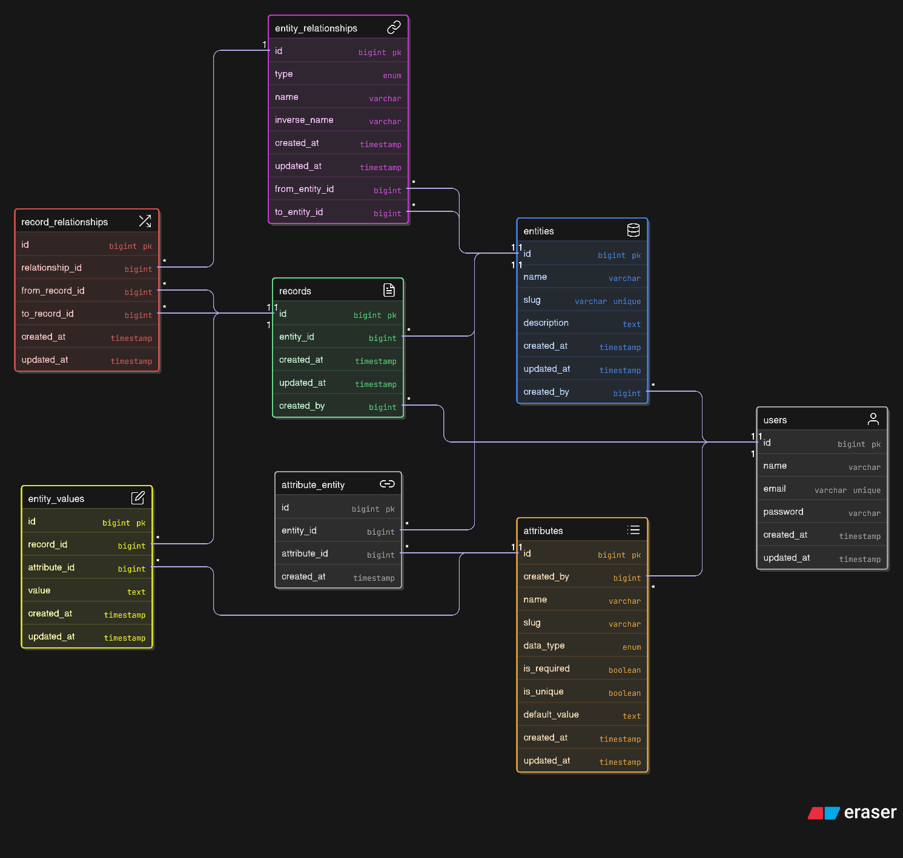

# 🧩 Dynamic CMS Backend API

A Laravel-based backend API for a generic Content Management System (CMS), designed to allow full **dynamic entity creation**, **custom attributes**, and **content management**.

---

## ERD Digram
**Note**: After project installation head to **localhost:8000/docs** to read the project documentation


---
## 🚀 Setup Instructions
### 🚢 Quick Start with Docker
#### Prerequisites
- [Docker](https://www.docker.com/get-started)
- [Docker Compose](https://docs.docker.com/compose/)

#### Instructions
- **Clone the repository**
```bash
git clone https://github.com/Aero-Mohamed/cms-api.git
cd cms-api
chmod 644 ./docker/mysql/my.cnf
```
As we are in development mode, we mount the current project directory into the container.
So, we need to change the permissions of the MySQL configuration file.

- **Build and Start Containers**
```bash
docker-compose up -d --build
docker exec -it dynamic_cms bash
```
This builds the Docker containers and starts the Laravel app, MySQL, Redis, and Nginx services.
Then, Open an interactive terminal session inside the Laravel PHP container (called dynamic_cms).

- **Run the Installation Script**
```bash
chmod 755 install.sh
./install.sh
```

---

## 🧠 Project Overview

This CMS backend supports two roles:

- **Admin**:
    - Creates dynamic entities (e.g., `Product`, `Article`, `Project`)
    - Defines custom attributes (text, number, date, boolean, etc.)
    - Manages relationships between entities

- **Operator**:
    - Views and fills content based on Admin-defined schemas
    - Uses auto-generated forms powered by the entity definitions

---

## 📦 Features

- Dynamic **entity & field creation**
- Support for multiple field types: `text`, `number`, `date`, `boolean`
- Admin vs Operator roles with role-based access
- Simple and extendable API structure
- RESTful resource routing
- JWT-based authentication (Laravel Passport)

## 🛠️ Technologies

- **Laravel 12+**
- **MySQL DB**
- **Eloquent ORM**
- **Laravel Passport** for API auth

---

# 🧪 Continuous Integration (CI)

This project uses **GitHub Actions** to automatically run tests and code quality checks on every push to:

- `develop`
- Any `feature/**` branch

### CI Workflow Summary

The CI pipeline runs the following checks:

| Step                           | Description                                                 |
|--------------------------------|-------------------------------------------------------------|
| ✅ PHP Lint & Version Check     | Ensures PHP 8.3 is used                                     |
| ✅ Composer Install & Cache     | Installs dependencies with cache optimization               |
| ✅ Database Setup               | Runs php artisan migrate and migrate:fresh --seed using MySQL container                  |
| ✅ Security Audit             | Scans for known security vulnerabilities in `composer.lock` |
| ✅ PHPStan + Larastan           | Static analysis and type checking                           |
| ✅ PHPCS                        | PSR-12 code style checks                                    |
| ✅ Tests Execution              | Runs php artisan test --coverage                                       |

### Workflow Configuration

- File path: `.github/workflows/dynamic-cms-ci.yml`
- Trigger: On push to `develop` or `feature/**` branches

---

## 🛡️Code Standard & Quality
- Use command `composer lint` to run the following checks:
    - Static Code Analysis (PHP Stan + LaraStan) - Testing for potential errors.
        - `./vendor/bin/phpstan analyse`
    - Php Code Sniffer (PSR-12).
        - Detect Problems `./vendor/bin/phpcs --standard=PSR12 app`
        - Fix Problems `./vendor/bin/phpcbf --standard=PSR12 app`

---

## 🧱 Git Workflow

This project follows the **Git Flow** branching model.

### Branch Structure

- `main` – Stable, production-ready code
- `develop` – Active development branch
- `feature/*` – Feature branches
- `release/*` – Pre-release staging branches
- `bugfix/*` – Small isolated fixes
- `hotfix/*` – Emergency fixes for `main`
- `support/*` – Support branches for old releases
- Versions – `v1.0.0`, `v1.1.0`, etc.

### Git Flow Commands Used

This repo uses [Git Flow](https://nvie.com/posts/a-successful-git-branching-model/) via the CLI tool:

---

## 📃 License

This project is licensed under the MIT License – see the [LICENSE](./LICENSE) file for details.
